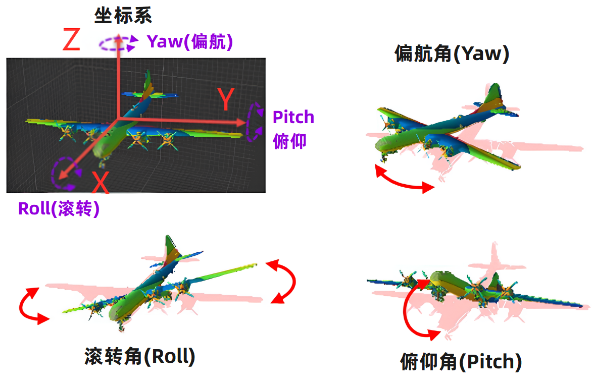
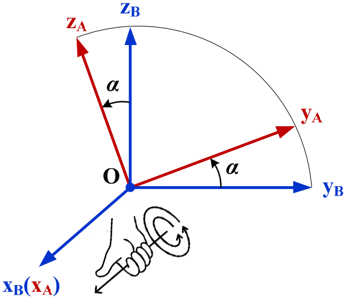
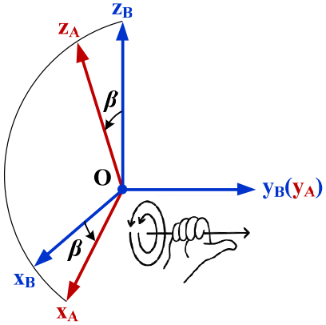
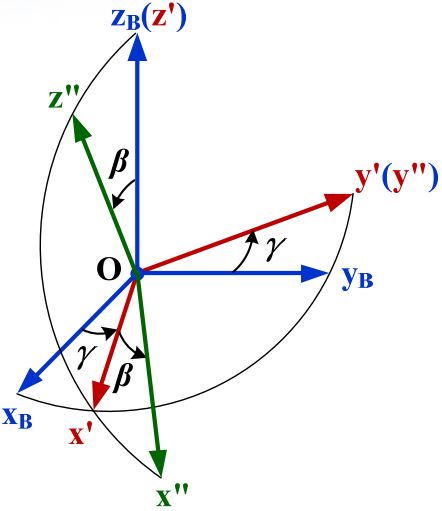
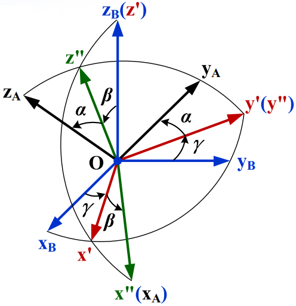

# **姿态表示与转换**

在航天任务仿真计算中，常需分析卫星的星上载荷指向与覆盖范围，例如判断太阳能板是否正对太阳、望远镜是否精确瞄准深空目标等。这类问题的本质，在于准确描述卫星本体及其载荷相对于特定参考坐标系的方位与指向，即卫星和载荷的姿态问题。

目前常用的姿态表示方法主要包括**欧拉角、四元数和方向余弦矩阵**三种。本文将简要介绍它们的**定义、适用场景，并提供相应的程序实现**，为相关仿真计算提供参考。

# **欧拉角**

## **什么是欧拉角？**

欧拉角直观表达：绕 X 轴转多少度，绕 Y 轴转多少度，绕 Z 轴转多少度。

欧拉角通过三个绕坐标轴的连续旋转角度来实现，这种表达方式直观且易于理解。例如我们可以用“先绕Z轴转30°，再绕新Y轴转20°，最后绕新X轴转10°”这样的语言来描述一个姿态。

在航空航天领域，最常用的是“偏航—俯仰—滚转”（Yaw–Pitch–Roll）序列，如下图所示。



## **核心概念**

### **旋转方式分类**

- **内旋（Intrinsic Rotation）：** 也称为动态旋转，指每次旋转都是相对于上一次旋转后的新坐标系进行。记作z-y′-x″，其中`′`表示该旋转基于上一次旋转后的坐标系。
- **外旋（Extrinsic Rotation）：** 也称为静态旋转，指所有旋转都相对于最初的固定坐标系进行。记作z-y-x。

### **旋转序列类型**

欧拉角通过三次绕不同坐标轴的旋转来描述姿态，一个常见的问题是：如果采用不同的旋转顺序（例如，一个采用ZXY顺序，另一个采用XYZ顺序旋转相同的角度），最终的姿态是否一致？我们可以自己动手模拟尝试一下，结果是否定的。**最终姿态和旋转的顺序有关：** 如果旋转的顺序不同，即使分别绕轴的角度相同，也会产生完全不同的姿态。

按旋转轴是否重复，欧拉角可分为两大类：
1. **经典欧拉角**：

   `z-x-z,x-y-x,y-z-y,z-y-z,x-z-x,y-x-y`
   
   允许绕同一个轴旋转两次，这类组合共有 3×2=6 种。

2. **泰特—布赖恩角**：

   `x-y-z,y-z-x,z-x-y,x-z-y,z-y-x,y-x-z`
   
   各次旋转围绕不同的坐标轴进行，其排列数为 3!=6 种；

> 还有一种理解是：
>
> - 第一次旋转：可以选择XYZ中的一个，有3种选择；
>- 第二次旋转：不能和上次（第1次）一样，所以只有2个选择；
> - 第三次旋转：同样不能和上次（第2次）一样，所以仍然只有2个选择。
>
> 即3×2×2=12种。

因此，欧拉角一共存在12种合法的旋转序列。这一特性要求在使用欧拉角时必须明确指出旋转顺序，否则相同的三个角度可能会对应完全不同的空间姿态。

> 注意：上述旋转序列没有考虑内旋与外旋。
>
> - 不考虑内旋与外旋时：经典欧拉角和泰特布莱恩角各有6种绕轴旋转方式;
> - 如果考虑内旋与外旋：则各有12种绕轴旋转方式。

### **万向节死锁**

为了直观理解万向节死锁现象，推荐观看此视频：[万向锁？四元数？必须早点学会的技能！](https://www.bilibili.com/video/BV1nKKzz5EU7)。

当**旋转顺序为A-B-C型**，中间的旋转轴（取决于旋转顺序）旋转 ±90 度时，第三个旋转轴会与第一个旋转轴重合。此时会失去一个自由度。无论你怎么转第三个轴，效果都和转第一个轴一样。

> **可以用手来模拟一下万向节死锁的过程：**
>
> 1. **初始状态**
>
>    右手平放在桌面上，手指指向 12 点钟方向，手心朝下。
>
>    对应欧拉角： 偏航角 $yaw = 0^\circ$， 俯仰角 $pitch = 0^\circ$， 滚转角 $roll = 0^\circ$
>
> 2. **路径 A**  
>
>    1. **第一步**：手逆时针旋转 90°（偏航角 $yaw = 90^\circ$）。
>
>       手指指向 9 点钟方向，手心仍然朝下。  
>
>    2. **第二步**：抬起手，让手臂垂直桌面（俯仰角 $pitch = 90^\circ$）。
>
>       手指指向天，手心指向 9 点钟方向。  
>
> 3. **路径 B**  
>
>    1. **第一步**：保持初始状态（偏航角 $yaw = 0^\circ$）。  
>
>    2. **第二步**：抬起手垂直桌面（俯仰角 $pitch = 90^\circ$）。
>
>       手指指向天，手心指向 12 点钟方向。  
>
>    3. **第三步**：绕手臂轴（即手指方向）旋转手心 90°（滚转角 $roll = 90^\circ$）。
>
>       手指仍然指向天，手心指向 9 点钟方向。  
>

**你会惊奇的发现：** 路径 A（先偏航 90° 再俯仰 90°）与路径 B（先俯仰 90° 再滚转 90°）的最终姿态完全相同！并且无论你怎么改变偏航角，效果都等价于改变滚转角，无法实现“围绕垂直方向”的真正偏航。  

上述这个例子中当第二步的俯仰角为 **±90°** 时，**偏航和滚转实际上是在绕同一个空间轴旋转**，因此失去了一个旋转自由度。这就是 **万向节死锁**：三个旋转轴中有两个瞬间对齐，导致系统丢失一个自由度。  

另外当**旋转顺序是A-B-A型时**，中间的旋转轴旋转180度时，也会发生死锁现象。

## **适用场景**

欧拉角（俯仰、偏航、滚转）作为一种符合人类空间直觉的旋转表示方法，确实在概念上便于理解与操控。在航天仿真、三维建模软件和游戏开发中，欧拉角的直观性使其**易于理解和操作，便于工程师和操作人员直接读取和调整姿态参数**。

然而，在将这种表示方法应用于计算机程序，尤其是需要处理连续、复合旋转的系统（如飞行器姿态控制或卫星动力学仿真）时，其数学与计算上的局限性便显著暴露：

1. **万向节死锁**：这是欧拉角在特定构型下出现的奇异性问题。当第二个转角趋近±90°(A-B-C型转序)以及0/180°(A-B-A型转序)时，旋转序列中的第一轴与第三轴发生共线，导致系统失去一个旋转自由度，严重影响运动控制的稳定性与准确性。

2. **插值困难**：欧拉角直接对各分量进行直接线性插值，这无法得到旋转球面上的最短路径。这常导致动画过程中的姿态突变、角速度失真或旋转轴不连续等问题。

**显然，对人类直观的参数化表示，未必适用于高效、稳定的数值计算。**

# **四元数**

为解决欧拉角在连续旋转系统中的根本性缺陷（万向节死锁、插值困难），航空航天领域、计算机图形学与机器人学广泛采用**四元数**作为旋转表示的核心数学工具。四元数从数学结构上彻底避免了奇异性问题，并为旋转计算提供了数值稳定且高效的框架。

## **定义**

### **数学定义**

四元数是复数在三维空间中的自然延伸，构成一个**不可交换的**结合代数。一个四元数 $q$ 定义为：

$$
\boxed{q = w + xi + yj + zk \quad \text{等价} \quad q = [w, \vec{v}]}
$$

其中：

- $w$ 为**实部**（标量）
- $\vec{v} = (x, y, z)$ 为**虚部**（三维向量）
- 虚数单位 $i, j, k$ 满足如下核心代数关系：

$$
i^2 = j^2 = k^2 = ijk = -1
$$

### **轴-角表示法**

用于表示纯三维旋转的四元数必须是**单位四元数**，即满足归一化条件：

$$
w^2 + x^2 + y^2 + z^2 = 1
$$

此条件并非外部约束，而是四元数表示纯旋转的**内在要求**。它保证了四元数作用于向量时保持长度不变，即所表示的变换为**纯旋转，不含缩放成分**。

从几何角度，任一单位四元数可由一个**旋转轴** $\vec{u}$（单位向量）和一个**旋转角** $\theta$ 直接构造：

$$
\boxed{q = \cos\frac{\theta}{2} + \sin\frac{\theta}{2} \, \vec{u}}
$$

## **几何含义**

对于单位四元数 $q = [w, (x, y, z)]$，其分量具有明确的几何意义：

**实部 $w$：旋转半角的余弦**

$$
w = \cos(\theta/2)
$$

其中：

- $w = 1$ 对应 $\theta = 0^\circ$（无旋转）
- $w = 0$ 对应 $\theta = 180^\circ$（半角为 $90^\circ$）
- $w \in [-1, 1]$​ 覆盖所有可能旋转


**虚部 $\vec{v} = (x, y, z)$：旋转轴与半角正弦的乘积**

$$
\vec{v} = \sin(\theta/2) \cdot \vec{u}
$$

其中：

- 方向 $\vec{u}$：单位向量，表示旋转轴的方向
- 模长 $\|\vec{v}\| = \sin(\theta/2)$：旋转半角的正弦值

## **直观含义**

单位四元数 $q = [w, \vec{v}]$ 的实质是：

> 它存储了 **“用最短路径从标准姿态旋转到当前姿态”所需的信息**，但这个信息被打包成了一个**四维单位向量**。

欧拉角直接描述物体的**最终朝向**，而四元数存储的是**从初始姿态到目标姿态的旋转动作本身**。

它将“**绕轴 $\vec{u}$ 旋转角度 $\theta$**”这一几何操作，编码为四个数 $[w, \vec{v}]$，构成一个紧凑的四维数学（ $w,x,y,z$）表示。

具体来说：

- 在三维空间中，任意两个姿态间总存在一个**唯一的、绕某固定轴旋转最小角度**的变换（欧拉旋转定理）。
- 该变换的轴 $\vec{u}$ 与半角 $\theta/2$ 被映射为：
  -  实部：$w = \cos(\theta/2)$
  -  虚部：$\vec{v} = \sin(\theta/2) \cdot \vec{u}$
- 这一映射自动满足 $w^2 + \|\vec{v}\|^2 = 1$（ $w^2+x^2+y^2+z^2=1$），使 $q$ 成为四维单位球面 $S^3$ 上的一点。

## **适用场景**

四元数在以下核心技术场景中具有关键应用：

1. **姿态控制与导航系统**：作为无奇异性的姿态表示方法，四元数广泛应用于飞行器、卫星和机器人的姿态解算与控制回路中。
2. **实时动画与运动插值**：在计算机动画和游戏引擎中，四元数的球面线性插值可生成平滑自然的旋转过渡，避免了欧拉角插值可能产生的抖动和路径扭曲。

总体而言，四元数通过将三维旋转提升至四维单位球面这一光滑流形上进行表示，以其**无奇异性**、**插值最优性**及**计算高效性**，成为现代工程与科学计算中处理三维旋转问题的核心技术工具。尽管其几何直观性不及欧拉角，但在需要连续旋转表示、复合运算及数值稳定性的实时系统中，四元数具有不可替代的地位。实践中常采用“**欧拉角用于人机交互，四元数用于内部计算**”的混合策略，兼顾了直观性与数值鲁棒性。

> **数值鲁棒性**指的是算法或数学模型在面临**非理想数据**（如浮点误差、舍入误差、接近奇异的输入、噪声干扰、边界条件等）时，仍能保持**稳定、可靠**的计算结果，而不会出现灾难性失败（如崩溃、溢出、结果剧烈偏差或完全错误）的能力。

# **方向余弦矩阵**

方向余弦矩阵是描述三维旋转最基础、最通用的数学表示形式，是姿态建模、轨道动力学与载荷指向分析的核心数学工具。

在航天计算仿真中，方向余弦矩阵**直接定义了不同坐标系之间的转换关系**，故也被称为坐标转换矩阵。

## **平面内的坐标转换**

如下图所示，设有两个平面坐标系：蓝色为参考坐标系 $O_A-X_AY_A$，红色为目标坐标系 $O_B-X_BY_B$。坐标系 $O_B$ 可视为 $O_A$ 绕其原点**逆时针**旋转角度 $\theta$​ 后所得。**现在希望把坐标系A中的坐标转换到坐标系B中**。

> 注意：通常采用右手法则，以逆时针旋转为正，顺时针旋转的时候 $\theta$ 定为负。


### **坐标视角**

要得到从坐标系 $A$ 到 $B$ 的转换矩阵 $R_A^B$，只需：

1. **找出 $A$ 的坐标轴在 $B$ 中的坐标**
2. **把它们作为列向量拼成矩阵**

例如三维坐标系中坐标转换矩阵为：

$$
R_A^B = \begin{bmatrix}
\text{$X_A$在$B$坐标}，\text{$Y_A$在$B$坐标}，\text{$Z_A$在$B$坐标}
\end{bmatrix}
$$


找出 $A$ 的坐标轴在 $B$ 中的坐标，可得：

- $A$ 的 X 轴在 $B$ 中：$(\cos\theta, -\sin\theta)$
- $A$ 的 Y 轴在 $B$ 中：$(\sin\theta, \cos\theta)$

代入得：
$$
R_A^B = \begin{bmatrix}
\cos\theta & \sin\theta \\
-\sin\theta & \cos\theta
\end{bmatrix}
$$


**要点说明：**

- 逆时针为正只是常见约定，当顺时针旋转记为负角度时，代入构造的矩阵依然正确
- 实际使用时无需记忆特定公式，直接按"**原坐标系轴**在**目标系**中的坐标"（方向不要搞错）这一原则构造即可

### **点积视角**

方向余弦矩阵 $R_A^B$ 的第 $i$ 行第 $j$ 列元素，是 $O_A$ 的第 $j$ 个基矢量与 $O_B$ 的第 $i$ 个基矢量的点积。设 $\hat{x}_A,\hat{y}_A$ 与 $\hat{x}_B,\hat{y}_B$ 为对应的单位基矢量，则：

$$
R_A^B = \begin{bmatrix}
\hat{x}_A \cdot \hat{x}_B & \hat{y}_A \cdot \hat{x}_B \\
\hat{x}_A \cdot \hat{y}_B & \hat{y}_A \cdot \hat{y}_B
\end{bmatrix}
$$

该形式显式揭示了该矩阵亦被称为 **方向余弦矩阵（DCM）** 的原因——其元素为两坐标系坐标轴夹角的余弦值。

> 坐标轴单位矢量的点积，即其夹角余弦，则 $\hat{x}_A \cdot \hat{x}_B = 1 \times 1 \times \cos(\angle(\hat{x}_A, \hat{x}_B))$

代入二维旋转的几何关系：

- $\hat{x}_A \cdot \hat{x}_B = \cos\theta$
- $\hat{y}_A \cdot \hat{x}_B = \cos(90^\circ - \theta) = \sin\theta$
- $\hat{x}_A \cdot \hat{y}_B = \cos(90^\circ + \theta) = -\sin\theta$
- $\hat{y}_A \cdot \hat{y}_B = \cos\theta$

得到：

$$
R_A^B = \begin{bmatrix}
\cos\theta & \sin\theta \\
-\sin\theta & \cos\theta
\end{bmatrix}
$$

## **旋转方向与逆变换**

在前文的推导中，我们始终遵循了一个重要约定：**以逆时针旋转为正角度**。这是右手坐标系的标准约定。

前文方向余弦矩阵由逆时针旋转 $\theta$ 得到时，$\theta > 0$。若改为顺时针旋转相同角度（即旋转 $-\theta$），则有：
$$
\begin{aligned}
R_A^B(-\theta) &= \begin{bmatrix}
\cos(-\theta) & \sin(-\theta) \\
-\sin(-\theta) & \cos(-\theta)
\end{bmatrix} \\
&= \begin{bmatrix}
\cos\theta & -\sin\theta \\
\sin\theta & \cos\theta
\end{bmatrix}
\end{aligned}
$$

比较可得重要结论：

$$
R_A^B(-\theta) = R_A^B(\theta)^T = R_A^B(\theta)^{-1}
$$

$$
R^T R = R R^T = I
$$

方向余弦矩阵的逆等于其转置，可以用矩阵转置代替求逆运算，提升数值稳定性。

## **三维空间的旋转**

将上述原理扩展至三维，方向余弦矩阵变为 $3 \times 3$ 矩阵，并且三维旋转可分解为绕三个坐标轴的连续旋转来描述。

### **基本转换矩阵**

绕单个坐标轴旋转构成的矩阵称为初等/基本转换矩阵，基本转换矩阵是构建任意旋转的基础， **同样其每一列均为原坐标轴的单位方向向量在旋转后坐标系下的坐标**。

#### **1. 绕 X 轴旋转**



设坐标系 $O_A$ 由 $O_B$ 绕 $X$ 轴逆时针旋转 $\alpha$ 角，**绕 $X$ 轴旋转的矩阵是二维转换矩阵的自然扩展，仅影响 $YZ$ 平面**：

$$
R_X(\alpha) = \begin{bmatrix}
1 & 0 & 0 \\
0 & \cos\alpha & \sin\alpha \\
0 & -\sin\alpha & \cos\alpha
\end{bmatrix}
$$

- **构造方法**：

  - $X$ 轴不变：$\hat{x}_B$ 在 $A$ 中为 $(1, 0, 0)^T$
  - $Y$ 轴在 $A$ 中：$\hat{y}_B$ 在 $A$ 中为 $(0, \cos\alpha, -\sin\alpha)^T$
  - $Z$ 轴在 $A$ 中：$\hat{z}_B$ 在 $A$ 中为 $(0, \sin\alpha, \cos\alpha)^T$

  **注意**：这里构造的是 $R_B^A$，即从 $B$ 系到 $A$ 系的转换矩阵。

- **点积视角验证**：

$$
\begin{aligned}
R_X(\alpha) &= \begin{bmatrix}
\hat{x}_B \cdot \hat{x}_A & \hat{y}_B \cdot \hat{x}_A & \hat{z}_B \cdot \hat{x}_A \\
\hat{x}_B \cdot \hat{y}_A & \hat{y}_B \cdot \hat{y}_A & \hat{z}_B \cdot \hat{y}_A \\
\hat{x}_B \cdot \hat{z}_A & \hat{y}_B \cdot \hat{z}_A & \hat{z}_B \cdot \hat{z}_A
\end{bmatrix} \\
&= \begin{bmatrix}
1 & 0 & 0 \\
0 & \cos\alpha & \sin\alpha \\
0 & -\sin\alpha & \cos\alpha
\end{bmatrix}
\end{aligned}
$$

#### **2. 绕 Y 轴旋转**



设坐标系 $O_A$ 由 $O_B$ 绕 $Y$ 轴逆时针旋转 $\theta$ 角得到：

$$
R_Y(\beta) = \begin{bmatrix}
\cos\beta & 0 & -\sin\beta \\
0 & 1 & 0 \\
\sin\beta & 0 & \cos\beta
\end{bmatrix}
$$

#### **3. 绕 Z 轴旋转**


设坐标系 $O_A$ 由 $O_B$ 绕 $Z$ 轴逆时针旋转 $\gamma$ 角得到：

$$
R_Z(\gamma) = \begin{bmatrix}
\cos\gamma & \sin\gamma & 0 \\
-\sin\gamma & \cos\gamma & 0 \\
0 & 0 & 1
\end{bmatrix}
$$

### **三维旋转的复合**

在三维空间中，复杂旋转通常由多个基本旋转复合而成。**旋转顺序至关重要**，连续旋转对应矩阵乘法，且**矩阵乘法顺序与旋转顺序相反**。航天领域最常用的序列是 **Z-Y-X（偏航-俯仰-滚转）**，该序列直接对应欧拉角的常用工程定义。

下面我们来模拟这个复合旋转过程：

1. 步骤一：先绕Z轴旋转 $\gamma$ 角，$R = R_z(\gamma)$

   > 物理意义：$\gamma$ 为**偏航角（Yaw）**，表示物体在水平面内的转动。


2. 步骤二：在绕Z轴旋转的基础上，再绕Y轴旋转 $\beta$ 角，$R = R_y(\beta)\, R_z(\gamma)$​

   > 物理意义：$\beta$ 为**俯仰角（Pitch）**，表示物体抬头或低头的角度。



3. 步骤三：最后绕X轴旋转，$R = R_x(\alpha)\, R_y(\beta)\, R_z(\gamma)$​

   > 物理意义：$\alpha$ 为**滚转角（Roll）**，表示物体绕自身纵轴的旋转。



### 坐标转换

将 $O_A$ 中的坐标 $\vec{v}_A$ 转换到 $O_B$​ 中：
$$
\boxed{\vec{v}_B = R_A^B \, \vec{v}_A}
$$

实际上不需要记忆具体的转换矩阵公式，也无需记左右和方向，只需掌握以下构造原则：

> **想要把某个坐标向量从当前坐标系转换到目标坐标系中：**
>
> 1. 先写出**当前坐标系的坐标轴单位向量在目标坐标系中的坐标**
> 2. 将坐标作为**列向量**，从左到右按X、Y、Z轴的顺序拼接，即得到坐标转换矩阵 $R_A^B$
> 3. 用该矩阵左乘当前坐标向量，即得到目标坐标系中的坐标

## **适用场景**

### **在航天任务中的应用**

**卫星姿态矩阵的构建**：
假设卫星相对于惯性坐标系的姿态用欧拉角 $(\psi, \theta, \phi)$ 表示（偏航、俯仰、滚转），则卫星本体坐标系到惯性坐标系的姿态矩阵 $R_B^I$ 的转换矩阵为：
$$
R_B^I = R_z(\psi) R_y(\theta) R_x(\phi)
$$

**坐标变换**：
卫星载荷测量的目标方向 $\vec{v}_B$（在本体系中的坐标）转换到惯性系：

$$
\vec{v}_I = R_B^I \, \vec{v}_B
$$

反之，惯性系中的目标方向转换到本体系：

$$
\vec{v}_B = R_I^B \vec{v}_I = {R^I_B}^T \, \vec{v}_I
$$


### **总结**

方向余弦矩阵作为姿态表示的数学基础，提供了最直接和通用的坐标变换描述。尽管在存储效率（9个参数）和插值方面不及四元数，在直观性方面不及欧拉角，但其理论的完备性以及在描述坐标系关系、进行底层坐标变换方面的优势，使其在航天动力学、机器人学和计算机图形学中始终占据核心地位。在实际工程中，常根据需求在矩阵、四元数与欧拉角之间灵活转换，以兼顾计算效率、数值稳定性和操作直观性。

- **与欧拉角**：按选定序列乘基本旋转矩阵。当第二个转角趋近±90°(A-B-C型转序)以及0/180°(A-B-A型转序)时，欧拉角出现万向节死锁，但矩阵表示依然有效。
- **与四元数**：存在标准转换公式。在需要平滑插值或高效组合旋转时，常转换为四元数运算以获得更好的数值稳定性。


# 附录：程序实现

附录程序使用了Eigen库所提供的数据结构，实现四元数、坐标转换矩阵、欧拉角、角度轴之间的转换。

## 程序头定义

### 常数与宏定义

```cpp
#include "Eigen/Dense"
#include <cstdio>
#include <cassert>
#include <cmath>

#define Error(fmt, ...)      fprintf(stderr, fmt, ##__VA_ARGS__)
#define TO_EULER_EPS         1e-15

constexpr double kHalfPI     =  1.5707963267948966192313216916395	                 ;	    ///< 0.5 * pi
constexpr double kPI         =  3.141592653589793238462643383279502884197169399375105;      ///< pi


#if  defined(__GNUC__) && !defined(__clang__) 
using ::sincos;
#else
inline void sincos (double x, double *psin, double *pcos)
{
    *psin = sin(x);
    *pcos = cos(x);
}
#endif


template<typename _Scalar>
int sign(_Scalar val)
{
    if(val > 0)
        return 1;
    else if(val < 0)
        return -1;
    return 0;
}

using Eigen::Matrix3d;
using Quaternion = Eigen::Quaterniond;
using AngleAxis = Eigen::AngleAxisd;
```


### 欧拉角定义

```cpp
/// @brief 欧拉角
/// @details 欧拉角是一种表示旋转的参数化方法，
///          它将旋转分解为三个连续的旋转轴上的角度。
///          欧拉角通常用于描述物体的旋转状态，
///          例如在机器人学、航空航天和计算机图形学中。
class Euler
{
public:
    // 欧拉角转序
    enum ERotationOrder
    {
        eX = 1,
        eY = 2,
        eZ = 3,
        eXYZ = 123,
        eXZY = 132,
        eYXZ = 213,
        eYZX = 231,
        eZXY = 312,
        eZYX = 321,
        eXYX = 121,
        eXZX = 131,
        eYXY = 212,
        eYZY = 232,
        eZXZ = 313,
        eZYZ = 323
    };
    
    double angle1() const{return angle1_;}
    double angle2() const{return angle2_;}
    double angle3() const{return angle3_;}
    double& angle1(){return angle1_;}
    double& angle2(){return angle2_;}
    double& angle3(){return angle3_;}
    
public:
	double	angle1_;	///< 第一个转角
	double	angle2_;	///< 第二个转角
	double	angle3_;	///< 第三个转角
};

```


## 四元数与坐标转换矩阵

```cpp
/// @brief 四元数转坐标转换矩阵
/// @param quat 四元数
/// @param m 坐标转换矩阵
void QuatToMatrix(const Quaternion& quat, Matrix3d& m)
{
	double xy = quat.x() * quat.y();
	double yz = quat.y() * quat.z();
	double zx = quat.z() * quat.x();
	double sx = quat.w() * quat.x();
	double sy = quat.w() * quat.y();
	double sz = quat.w() * quat.z();
	double xx = quat.x() * quat.x();
	double yy = quat.y() * quat.y();
	double zz = quat.z() * quat.z();

	m(0,0) = 1.0 - 2.0 * (yy + zz);	m(0,1) = 2.0 * (xy + sz);		m(0,2) = 2.0 * (zx - sy);
	m(1,0) = 2.0 * (xy - sz);		m(1,1) = 1.0 - 2.0 * (xx + zz);	m(1,2) = 2.0 * (yz + sx);
	m(2,0) = 2.0 * (zx + sy);		m(2,1) = 2.0 * (yz - sx);		m(2,2) = 1.0 - 2.0 * (xx + yy);

	for (int i = 0; i < 9; i++)
	{
		if (m(i) > 1.0)
			m(i) = 1;
		else if (m(i) < -1.0)
			m(i) = -1;
	}
}
```


```cpp
/// @brief 坐标转换矩阵转四元数
/// @param mtx 坐标转换矩阵
/// @param quat 四元数
void MatrixToQuat(const Matrix3d& mtx, Quaternion& quat)
{
	double w = 1.0 + mtx(0, 0) + mtx(1,1) + mtx(2,2);
	quat.w() = sqrt(w) * 0.5;
	double tempdbl = 4.0 * quat.w();
	quat.x() = (mtx(1,2) - mtx(2,1)) / tempdbl;
	quat.y() = (mtx(2,0) - mtx(0,2)) / tempdbl;
	quat.z() = (mtx(0,1) - mtx(1,0)) / tempdbl;
}
```

## 欧拉角与坐标转换矩阵

```cpp
/// @brief 欧拉角(X-Y-Z转序)转坐标转换矩阵
/// @param euler 欧拉角
/// @param mtx 坐标转换矩阵
void EulerXYZToMatrix(const Euler& euler, Matrix3d& mtx)
{
	double a1 = euler.angle1();
	double a2 = euler.angle2();
	double a3 = euler.angle3();
	double cosa1, sina1, cosa2, sina2, cosa3, sina3;
	sincos(a1, &sina1, &cosa1);
	sincos(a2, &sina2, &cosa2);
	sincos(a3, &sina3, &cosa3);
	
	mtx <<
		cosa2 * cosa3,	cosa1 * sina3 + cosa3 * sina1 * sina2, sina1 * sina3 - cosa1 * cosa3 * sina2,
	   -cosa2 * sina3, cosa1 * cosa3 - sina1 * sina2 * sina3, cosa3 * sina1 + cosa1 * sina2 * sina3,
		sina2,            -cosa2 * sina1,                              cosa1 * cosa2
	;
}
```


```cpp
/// @brief 坐标转换矩阵转欧拉角(X-Y-Z转序)
/// @param mtx 坐标转换矩阵
/// @param euler 欧拉角
void MatrixToEulerXYZ(const Matrix3d& mtx, Euler& euler)
{
	if (std::abs(mtx(2, 0)) < 1. - TO_EULER_EPS)
	{
		euler.angle1() = atan2(-mtx(2, 1), mtx(2, 2));
		euler.angle2() = asin(mtx(2, 0));
		euler.angle3() = atan2(-mtx(1, 0), mtx(0, 0));
	}
	else {              // angle2 旋转90°/270°时有奇异
		euler.angle1() = atan2(mtx(1, 2), mtx(1, 1));
		euler.angle2() = sign(mtx(2, 0)) * kHalfPI;
		euler.angle3() = 0.;
	}
}
```


```cpp
/// @brief 欧拉角(X-Y-X转序)转坐标转换矩阵
/// @param euler 欧拉角
/// @param mtx 坐标转换矩阵
void EulerXYXToMatrix(const Euler& euler, Matrix3d& mtx)
{
	double a1 = euler.angle1();
	double a2 = euler.angle2();
	double a3 = euler.angle3();
	double cosa1, sina1, cosa2, sina2, cosa3, sina3;
	sincos(a1, &sina1, &cosa1);
	sincos(a2, &sina2, &cosa2);
	sincos(a3, &sina3, &cosa3);
	mtx <<
		cosa2,            sina1 * sina2,                               -cosa1 * sina2,
		sina2 * sina3,  cosa1 * cosa3 - cosa2 * sina1 * sina3,  cosa3 * sina1 + cosa1 * cosa2 * sina3,
		cosa3 * sina2, -cosa1 * sina3 - cosa2 * cosa3 * sina1,  cosa1 * cosa2 * cosa3 - sina1 * sina3
	;
}
```


```cpp
/// @brief 坐标转换矩阵转欧拉角(X-Y-X转序)
/// @param mtx 坐标转换矩阵
/// @param euler 欧拉角
void MatrixToEulerXYX(const Matrix3d& mtx, Euler& euler)
{
	if (std::abs(mtx(0, 0)) < 1. - TO_EULER_EPS)
	{
		euler.angle1() = atan2(mtx(0, 1), -mtx(0, 2));
		euler.angle2() = acos(mtx(0, 0));
		euler.angle3() = atan2(mtx(1, 0), mtx(2, 0));
	}
	else {            // angle2 旋转 0°/180°时有奇异
		euler.angle1() = atan2(mtx(1, 2), mtx(1, 1));
		if (mtx(0, 0) < 0)
			euler.angle2() = kPI;
		else
			euler.angle2() = 0;
		euler.angle3() = 0;
	}
}
```

其他欧拉角转序的转换函数的公式和代码与上面的类似，这里就不重复了。

## 角度轴与四元数的转换

```cpp
/// @brief 四元数转角度轴
/// @param quat 四元数
/// @param aa 角度轴
void QuatToAngleAxis(const Quaternion& quat, AngleAxis& aa)
{
	double n = quat.vec().norm();
	if(n)
	{
    	if (quat.w() < 0){
			aa.angle() = 2 * atan2(n, -(quat.w()));
			aa.axis() = quat.vec() / -n;
		}else{
			aa.angle() = 2 * atan2(n, (quat.w()));
			aa.axis() = quat.vec() / n;
		};
	}
	else
	{
		aa.angle() = 0;
		aa.axis() = {1, 0, 0};
	}
}
```


```cpp
/// @brief 角度轴转四元数
/// @param aa 角度轴
/// @param quat 四元数
void AngleAxisToQuat(const AngleAxis &aa, Quaternion &quat)
{
	double half_angle = aa.angle() / 2.;
	double sina = sin(half_angle);
	double cosa = cos(half_angle);
	quat = {
		cosa,
		aa.axis()[0] * sina,
		aa.axis()[1] * sina,
		aa.axis()[2] * sina,
	};
}
```