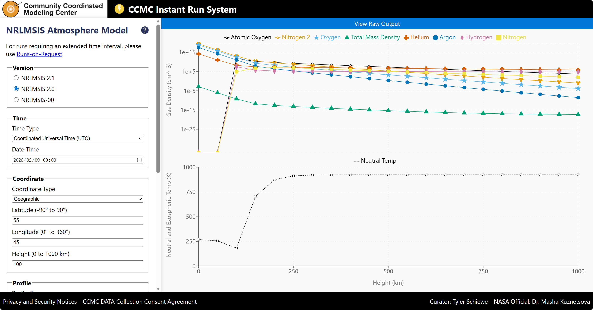

# 美国NASA社区协调建模中心

## 背景与使命

美国NASA[社区协调建模中心](https://ccmc.gsfc.nasa.gov/)（Community Coordinated Modeling Center，简称CCMC）是美国国家航空航天局（NASA）下属的一个研究机构，位于戈达德航天飞行中心（Goddard Space Flight Center）。

CCMC成立于1998年，旨在填补空间天气**研究到实际应用**之间的空白，促进空间天气模型研究向实际预报能力的转化。该中心的主要使命是通过跨机构合作，支持并开展下一代空间科学和空间天气模型的研究[^1]。

[^1]: [Concept of Operations for CCMC](https://ccmc.gsfc.nasa.gov/static/files/CONOPS_final.pdf)

## 模型目录

[模型目录](https://ccmc.gsfc.nasa.gov/models)展示了CCMC当前托管的各种空间天气模型，每个模型都有详细的描述、参数设置和运行说明，部分模型还提供了在线计算功能。

CCMC专门提供了模型提交入口[ModelOnboarding](https://ccmc.gsfc.nasa.gov/model-onboarding/)，科研人员可以在该平台上提交模型，CCMC会根据申请内容进行评估，并在评估通过后将模型添加到模型目录中。

模型目录包含了以下模型(部分)：

- 太阳活动模型: 太阳耀斑、日冕物质抛射、太阳风等活动的预测与威胁评估。

- 大气模型: 例如MSIS系列大气模型，计算大气密度、温度、压力、大气成分等。

- 磁场模型: 例如IGRF等磁场模型，计算磁场分布等。

- 辐射模型：例如AE8等电子辐射模型，AP8等质子辐射模型。

对于一些已不再维护的历史模型，CCMC提供了[ModelWebArchive归档库](https://git.smce.nasa.gov/ccmc-share/modelwebarchive)，可以查看和下载这些模型的存档版本。

## 在线运行

### 即时运行(Instant-Run)

[即时运行](https://ccmc.gsfc.nasa.gov/tools/instant-run/)可以通过网页界面输入相关参数，然后立即执行并查看结果。

### 连续/实时运行(Continuous/Real-time Run)

[连续/实时运行](https://ccmc.gsfc.nasa.gov/tools/continuous-run/)使用近实时的观测数据作为输入，模型运行后的结果通常会发送到可视化平台进行展示。

该结果将随着时间推移或根据最新发生的空间天气事件进行实时更新。

## 一些启示

- **模型标准化与可复现**：提供详细的模型描述、参数设置和在线运行环境，有助于模型对比、验证和标准化。

- **模型开放与共享**：建立专门机构将基础研究模型开放给公众，鼓励分享、使用和改进模型，有助于推动研究成果向工程应用快速转化。

