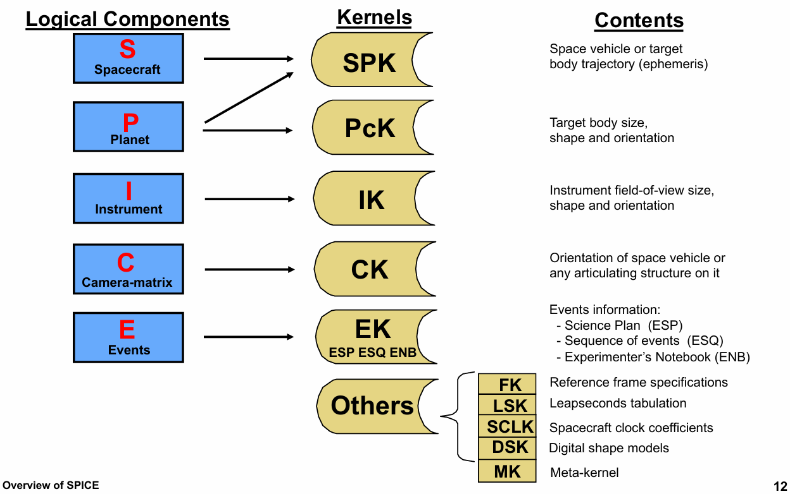
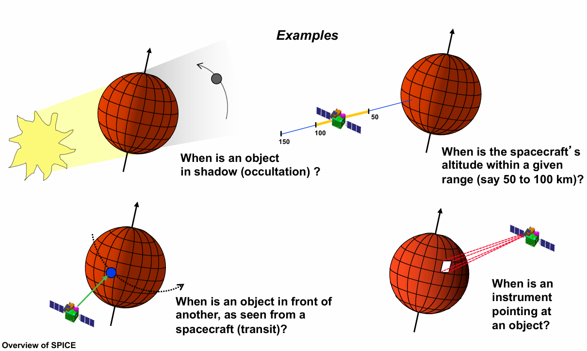

# 航天仿真工具SPICE概览

## SPICE仿真工具是什么

SPICE是NASA的[导航和辅助信息设施](https://naif.jpl.nasa.gov/naif/) (NAIF, The Navigation and Ancillary Information Facility)提供的一套信息系统，专为航天任务设计，用于协助科学家规划太空任务并分析从这些任务中获取的数据。 

## SPICE仿真工具的核心功能

SPICE库提供了丰富的航天动力学功能，主要包括：

- **位置和速度计算**：计算行星、彗星、小行星、航天器等的位置和速度
- **形状和姿态计算**：计算各类天体的形状、姿态指向，以及航天器及其子机构的姿态
- **仪器视场计算**：计算仪器视场在目标天体表面上的覆盖范围
- **时间系统转换**：支持多种时间系统(UTC、TT、TDB等)之间的精确转换
- **坐标系转换**：支持不同天文坐标系之间的转换
- **天文事件计算**：计算各类天文事件、航天器飞行任务中关键事件的发生时间以及相关参数。

## SPICE内核组件与数据文件

SPICE工具由多个内核模块组成，每种内核模块提供相应的内核数据文件和对应的函数接口，用于处理不同类型的数据。




SPICE的内核数据文件通常以`.bsp`、`.bpc`、`.tpc`、`.tf`、`.tls`等扩展名结尾，内核数据文件是SPICE工具运行的数据基础，需要用户下载并加载到SPICE环境中，具体包括以下几类：


| 内核 | 全称                         | 核心用途                               | 备注                       |
|-----|---------------------------  |----------------------------------------|----------------------------|
| SPK | Spacecraft and Planet Kernel| 天体/航天器位置速度（星历）               | 天文星历（如DE430） |
| PCK | Planetary Constants Kernel  | 天体的物理参数：质量、形状、自转、重力场等 | 来自IAU等科学组织<br>文本型(.tpc)<br>二进制型(.bpc) |
| IK  | Instrument Kernel           | 仪器视场几何参数（形状、尺寸、指向）       | 来自仪器制造商 |
| CK  | C-Matrix Kernel             | 航天器/部件姿态（四元数/矩阵）            | 按时间连续或离散存储         |
| EK  | Events Kernel               | 任务事件：ESP(计划)、ESQ(指令)、ENB(日志) | 使用较少                      |
| FK  | Frame Kernel                | 参考系定义及转换关系（固定/动态）         | 来自任务设计团队 |
| LSK | Leapseconds Kernel          | 闰秒表，用于UTC ↔ TDB/ET转换             | 来自IERS<br/>扩展名.tls            |
| SCLK| Spacecraft Clock Kernel     | 航天器时钟与ET的转换系数                 | 来自工程遥测<br/>扩展名.tsc            |
| DSK | Digital Shape Kernel        | 数字形状模型（曲面细分、数字高程模型）     | 来自科学团队<br/>扩展名.bds<br/>开发中 |
| MK  | Meta Kernel                 | 元内核，列出需加载的内核集合（文本文件）   | 用户自建<br/>便于批量加载            |

> 注：内核文件格式跨平台可移植，且支持**选择性加载**

> 可以发现`SPICE`这个名称就是前6种内核首字母缩写


这些内核数据又被SPICE称为辅助数据，可以从[NAIF的内核数据文件页面](https://naif.jpl.nasa.gov/naif/data.html)下载所需的数据文件。

SPICE所处理的辅助数据来源于航天任务各参与方：

- **航天器本身**：遥测姿态、时钟、工程状态
- **任务控制中心**：定轨结果、指令序列、事件计划
- **仪器研制团队**：视场定义、姿态指向
- **科学组织**：天体历表、形状模型、物理常数

NASA的NAIF将这些**异构、多源**的辅助数据进行**标准化打包**，形成上述内核文件，并提供SPICE工具给科学家与工程师统一调用。此外，在航天任务结束后，会将相关的辅助数据文件归档存储，便后续分析与研究。


## 安装SPICE

SPICE的[下载界面](https://naif.jpl.nasa.gov/naif/toolkit.html)提供了多种编程语言的实现，包括C、Fortran、IDL、Matlab、Java等。

C和Fortran版本需要下载并手动编译，对于Python用户，可以直接使用SpiceyPy库：

```bash
pip install spiceypy
```


## 基础使用示例

### 时间系统转换

SPICE支持多种时间系统之间的转换，包括UTC(协调世界时)、TT(地球时)、TDB(质心动力学时)和ET(星历时间)等。以下是时间系统转换的示例：

::: details

```c++
#include <iostream>
#include <string>
#include <iomanip>

#include "SpiceUsr.h"
#include "SpiceZfc.h"

int main() {
    std::cout << std::setprecision(15);

    // 加载内核数据文件
    furnsh_c("kernels/lsk/naif0012.tls");
    
    // 1. UTC字符串转换为ET(Ephemeris Time)
    std::string utc_str = "2023-01-01T12:00:00.000";
    SpiceDouble et;
    str2et_c(utc_str.c_str(), &et);
    std::cout << "ET: " << et << " 秒" << std::endl;
    
    // 2. ET转换为UTC字符串
    SpiceChar utc_out[32];
    // "C"表示日历格式，3表示毫秒精度
    et2utc_c(et, "C", 3, sizeof(utc_out), utc_out);  
    std::cout << "UTC时间: " << utc_out << std::endl;

    // 3. TAI转换为TT时间
    // 相对于J2000.0的秒数
    double tai = 1000;              
    double tt = tai;
    ttrans_("TAI", "TDT", &tt, 3, 3);
    std::cout << "TT时间: " << tt << " 秒" << std::endl;
    
    // 4. TT时间转换为TDB时间
    double tai_out = tt;
    ttrans_("TDT", "TDB", &tai_out, 3, 3);
    std::cout << "TDB时间: " << tai_out << " 秒" << std::endl;
    return 0;
}
```

:::


### 获取行星视位置

以下是一个使用SpiceyPy的简单示例，演示如何获取考虑光行差后的行星位置：

::: details

```python
import spiceypy as sp

# 加载所需的内核文件
sp.furnsh([
    'kernels/lsk/naif0012.tls',   #  闰秒数据内核(LSK)
    'kernels/spk/de430.bsp'       #  行星DE星历数据内核(SPK)
])     

# 设置时间
target = 'Mars Barycenter'          #  目标天体(火星系质心，与火星质心很接近)
observer = 'Earth'                  #  观测者(地球)
reference_frame = 'J2000'           #  参考坐标系(J2000)
aberration_correction = 'LT+S'      #  光行差修正项(aberration correction)

# 转换时间为ET(Ephemeris Time)
date_str = 'July 4, 2003 11:00 AM PST'
et = sp.str2et(date_str)

# 获取火星相对于地球的位置
position, light_time = sp.spkpos(target, et, reference_frame, aberration_correction, observer)

print(f"{date_str}时\n火星系质心相对于地球的位置(km): {position}")
print(f"光行时(s): {light_time}")

# 卸载内核文件
sp.kclear()
```

:::

### 天体姿态计算

天体姿态计算用于确定天体的指向和自转状态，SPICE通过CK内核文件提供天体姿态数据。以下是计算天体姿态的示例：

::: details


```python
import spiceypy as sp
import numpy as np

# 加载所需内核
sp.furnsh('kernels/lsk/naif0012.tls')
sp.furnsh('kernels/pck/pck00011.tpc')

# 设置参数
from_frame = 'IAU_EARTH'  # 源坐标系
to_frame = 'J2000'        # 目标坐标系

# 时间转换
date_str = '2013-01-01T12:00:00'
et = sp.utc2et(date_str)

# 获取姿态矩阵（方向余弦矩阵）
rot_mat = sp.pxform(from_frame, to_frame, et)
print(type(rot_mat))

print(f"{date_str}时，{from_frame}到{to_frame}的方向余弦矩阵:\n{np.array(rot_mat).reshape(3, 3)}")

# 计算欧拉角（ZYX顺序）
euler_angles = sp.m2eul(np.array(rot_mat).reshape(3, 3), 3, 2, 1)
print(f"对应的欧拉角(ZYX, 度): {[angle * 180 / np.pi for angle in euler_angles]}")

# 卸载内核
sp.kclear()
```

:::


### 坐标系转换

SPICE支持多种天文坐标系之间的转换，包括J2000、IAU_Mars、IAU_EARTH等。

- `sp.sxform`函数可以计算两个坐标系之间的6x6的转换矩阵，用于转换位置和速度6维向量。

- `sp.pxform`函数可以计算两个坐标系之间的3x3的转换矩阵，用于转换位置3维向量。

::: details

```python
import spiceypy as sp
import numpy as np

# 加载所需内核
sp.furnsh('kernels/lsk/naif0012.tls')
sp.furnsh('kernels/pck/pck00011.tpc')

# 设置参数
from_frame = 'IAU_EARTH'  # 源坐标系
to_frame = 'J2000'        # 目标坐标系

# 时间转换
date_str = '2013-01-01T12:00:00'
et = sp.utc2et(date_str)

# 获取坐标转换矩阵(6 x 6)
rot_mat = sp.sxform(from_frame, to_frame, et)

# 坐标转换
state_ecf = [-1000.0, 2000.0, 5000.0, 1.0, -0.5, 2.0]  # x,y,z, vx,vy,vz
state_j2000 = rot_mat @ state_ecf

print(f"ecf坐标: {state_ecf}")
print(f"J2000坐标: {state_j2000}")
```

:::


### 天文事件计算




SPICE的几何查找器功能（Geometry Finder）可以用于任务规划与科学任务窗口分析，SPICE工具提供了大量以`gf`开头函数用于计算天文事件。下表展示了SPICE里的一部分函数，用于求解满足特定约束条件的天文事件时间窗口：

|事件计算函数|约束类型|详细描述|
|---------------------------|------------|----------------------------|
|`gfdist`                        |距离条件|计算满足相对距离约束的时间窗口。|
|`gffove`<br>`gfrfov`<br>`gftfov`|视场条件|计算满足视场约束的时间窗口|
|`gfilum`                        |光照条件|计算满足光照角约束的时间窗口|
|`gfocce`<br>`gfoclt`            |遮挡条件|计算满足遮挡条件的时间窗口|
|`gfpa`                        |相位角条件|太阳-目标-观测者之间的夹角满足指定约束的时间窗口|
|`gfposc`                        |位置条件|计算满足位置约束的时间窗口|
|`gfrr`                          |距离速率|相对距离速率约束的时间窗口|
|`gfsep`                         |角度条件|两个天体在天空中的分开角度满足指定约束的时间窗口|
|`gfsubc`                      |星下点条件|计算满足星下点坐标约束的时间窗口|
|`gfevent`                     |自定义约束|计算满足用户自定义约束的时间窗口|


::: details

```python
import spiceypy as sp

# 加载内核
sp.furnsh('kernels/lsk/naif0012.tls')
sp.furnsh('kernels/spk/de430.bsp')
sp.furnsh('kernels/pck/pck00011.tpc')

et0 = sp.str2et("2007 JAN 01 00:00:00 TDB")
et1 = sp.str2et("2007 APR 01 00:00:00 TDB")
cnfine = sp.cell_double(2)
sp.wninsd(et0, et1, cnfine)
result = sp.cell_double(1000)

# 计算月球与地球之间的距离大于 400000 km 的时间间隔
sp.gfdist(
    "moon", "none", "earth", ">", 400000, 0.0, sp.spd(), 1000, cnfine, result
)

count = sp.wncard(result)
results = []
# 遍历结果，将每个时间间隔的左右端点转换为字符串并添加到 results 列表中
for i in range(0, count):
    left, right = sp.wnfetd(result, i)
    timstr_left = sp.timout(
        left, "YYYY-MON-DD HR:MN:SC.###### (TDB) ::TDB ::RND", 41
    )
    timstr_right = sp.timout(
        right, "YYYY-MON-DD HR:MN:SC.###### (TDB) ::TDB ::RND", 41
    )
    results.append(timstr_left)
    results.append(timstr_right)

# 打印结果
print(*results, sep='\n')

sp.kclear()
```

:::

## 总结

SPICE库是NASA开发的一个重要工具，为科学家和工程师提供了强大的航天仿真计算能力，可以为各类航天任务提供支持，包括：

- 行星探测任务
- 深空导航与通信
- 天文观测数据分析
- 航天任务数据归档

## 参考资料

- [SPICE官方网站](https://naif.jpl.nasa.gov/naif/)
- [SPICE教程](https://naif.jpl.nasa.gov/naif/tutorials.html)
- [SpiceyPy文档](https://spiceypy.readthedocs.io/)
- [SPICE内核文件](https://naif.jpl.nasa.gov/pub/naif/generic_kernels/)
- [SPICE概览](https://naif.jpl.nasa.gov/pub/naif/toolkit_docs/Tutorials/pdf/individual_docs/03_spice_overview.pdf)